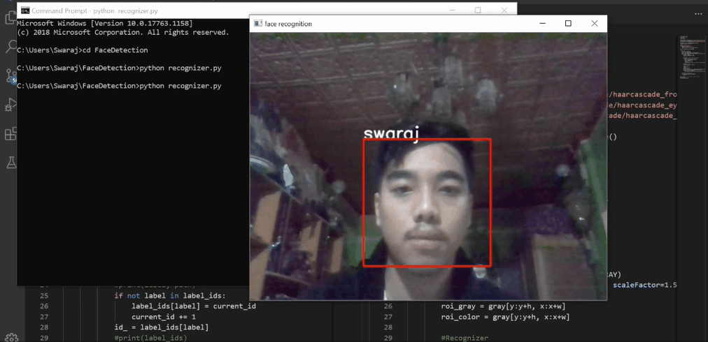

# Face-Detection
• This repository consists of files required to build a **Face Detection** system using **Open CV**

• I have used the **LBPHFaceRecognizer** to recognize images using my custom image dataset. 

• The HaarCascades can be downloaded from their repository on github https://github.com/opencv/opencv/tree/master/data/haarcascades

• Clone this repository to your local computer and train with your images
```
git clone https://github.com/killerrings/Face-Detection.git
```

• Please do ⭐ the repository, if it helped you

• A glimpse of the web app:<br>


